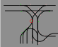

# About

FactorioRailAnalyzer (FRA) aims to analise a subset of a rail system given in as a Blueprint and determinant weather the
given blueprint is deadlock free or what the maximum save number of train carriages is.

# Context

This Project was made as part of a Paper for the DHBW Mannheim. The Paper can be found in this Repository under the
name "[FRA-Paper&documentation.pdf](FRA-Paper&documentation.pdf)". The Paper is sadly only available German.

# Usage

To use this Project, download the jar from releases. This jar can then be executed in the command line by typing java
-jar <Filename>. After that you can add CLI Options to modify the behavior.

To analyze a Blueprint, you can provide it in two ways. First, by directly putting it into the command line behind the
Filename. Second, by providing a Path to a Text file, in which the Blueprint is stored. This approach is recommended for
big Blueprints.

Several Parameters can be used:

Options:\
-h : Show CLI help\
-d : Show Debug Information\
-g : Create Graphviz Output \
-a : Open the Output automatically\
-c : Color in the Blocks in the Output

## Example

The Program takes the left side as an input and produces an output on the right (with -c flag)\
The output is currently WIP and will later show bedder information.\

Currently visible in the output is each block in Bag-Random color. The system does not ensure that adjacent blocks are not the same color. 
Signals are indicated with a green dot and Chain signals are shown in cyan. At the center of every block is the number of that block. 
This last information is not that useful to a user.

# Limitations

The Program is currently limited to mono-directional Rail systems bidirectional systems have not yet been tested.
There is still a good chance that there are some errors and bugs as the Factorio Rail-system is quiet complex and does
have a bunch of edge cases when looking at the details.

## Documentation

Within the Paper the Chapter 4 talks in great detail about the documentation and how different parts of the code works.
I may or may not translate this in the future on request for now i would hope that an automatic translation works for
you.
Listed below is the file structure and the relevant part in the text teat talks about it.

The beginning 4.1 talks about the general overview of the data processing and the data holding with in the application.
Also interesting could be [draw.io](https://app.diagrams.net/) file
found [here](src/main/kotlin/factorioRailAnalyserDiagrams.drawio) containing all the diagrams found in the document

Every listed file is found in [/src/main/kotlin/](/src/main/kotlin/)\
© are classes\
ⓘ are Interfaces\
📜 are kotlin scripts (.kt) unless marked otherwise

| Directory / File                                                                                    | Description                                                                                                                                               | Doc.Nr. |
|-----------------------------------------------------------------------------------------------------|:----------------------------------------------------------------------------------------------------------------------------------------------------------|:-------:|
| ┣ 📂[Classes](src/main/kotlin/Clases)                                                               | Contains classes needed for data processing                                                                                                               |         |
| ┃ ┣ © [Block](src/main/kotlin/Clases/Block.kt)                                                      | A group of Edges equal to a in game factorio block.                                                                                                       |  2.1.7  |
| ┃ ┣ © [Edge](src/main/kotlin/Clases/Edge.kt)                                                        | One edge is a list of Factorio objects from one signal to the next                                                                                        |  2.1.6  |
| ┃ ┣ © [EntityType](src/main/kotlin/Clases/EntityType.kt)                                            | An enum containing the entity types used in the project                                                                                                   |         |
| ┃ ┗ ⓘ[Grafabel](src/main/kotlin/Clases/Grafabel.kt)                                                 | An Interface implemented by Block and edge to make visualizations and Analysis code more general                                                          |         |
| ┣ 📂[factorioBlueprint](src/main/kotlin/factorioBlueprint)                                          | Contains the data classes that are extracted out of the blueprint                                                                                         |   2.2   |
| ┃ ┣ © [Blueprint](src/main/kotlin/factorioBlueprint/Blueprint.kt)                                   | Represents one factorio Blueprint                                                                                                                         |         |
| ┃ ┣ © [Entity](src/main/kotlin/factorioBlueprint/Entity.kt)                                         | Represents one factorio entity                                                                                                                            |         |
| ┃ ┣ © [Position](src/main/kotlin/factorioBlueprint/Position.kt)                                     | Holds an X and Y coordinate of one entity                                                                                                                 |         |
| ┃ ┗ © [ResultBP](src/main/kotlin/factorioBlueprint/ResultBP.kt)                                     | Wrapper needed by GSON                                                                                                                                    |         |
| ┣ 📂[FRA](src/main/kotlin/FRA)                                                                      | Contains the central execution logic and calls every other function                                                                                       |         |
| ┃ ┣ 📜[FRA](src/main/kotlin/FRA/FRA.kt)                                                             | Holds the call chain that does every thing                                                                                                                |   4.1   |
| ┃ ┣ © [CompanionCube](src/main/kotlin/FRA/CompanionCube.kt)                                         | Holds the runtime variables and functions to be called in sequence                                                                                        |   4.2   |
| ┃ ┣ 📜[railLinker](src/main/kotlin/FRA/railLinker.kt)                                               | Finds the neighbour of every entity and saves them for later use                                                                                          |   4.3   |
| ┃ ┣ 📜[edgeBuilder](src/main/kotlin/FRA/edgeBuilder.kt)                                             | Creates Edges from each rail signal to the next as well as beginning and ending edges                                                                     |   4.4   |
| ┃ ┣ 📜[BlockJoiner](src/main/kotlin/FRA/BlockJoiner.kt)                                             | Groupies overlying Edges into the same block                                                                                                              |   4.5   |
| ┃ ┣ 📜[Graph](src/main/kotlin/FRA/Graph.kt)                                                         | Contains an implementation of the [Tiernan](https://www.cs.tufts.edu/comp/150GA/homeworks/hw1/Johnson%2075.PDF) algorithm to find all elementary circuits |   4.6   |
| ┃ ┗ 📜[analyser](src/main/kotlin/FRA/analyser.kt)                                                   | Checks each found circular dependency to check if its an actual deadlock and or calculate the maximum save train length                                   |   4.6   |
| ┣ 📂[test](src/main/kotlin/test)                                                                    | Contains some tests we used to ensure the code behaved as intended                                                                                        |         |
| ┣ 📜[CLIOptions](src/main/kotlin/CLIOptions.kt)                                                     | Contains code surrounding the CLI al wel as the definitions for the options                                                                               |   4.8   |
| ┣ 📜[fact](src/main/kotlin/fact.kt)                                                                 | Contains static information about factorio rails and what other possible rails and signals could be connected                                             |  4.1.2  |
| ┣ 📜[output](src/main/kotlin/output.kt)                                                             | Contains the code that generates the svg as seen in the Example                                                                                           |  4.1.2  |
| ┣ 📜[Main](src/main/kotlin/Main.kt)                                                                 | Entry point for the CLI                                                                                                                                   |         |
| ┣ 📜[utility](src/main/kotlin/utility.kt)                                                           | contains various code used often ion the project or not having a bedder place                                                                             |         |
| ┣ 📜[exampleBP.txt](src/main/kotlin/exampleBP.txt)                                                  | This BP is used if none was provided also used in development                                                                                             |         |
| ┗ 📜[factorioRail AnalyserDiagrams.drawio](src/main/kotlin/factorioRailAnalyserDiagrams.drawio) | containing every diagram used in the final document + some wip diagrams                                                                                   |         |
